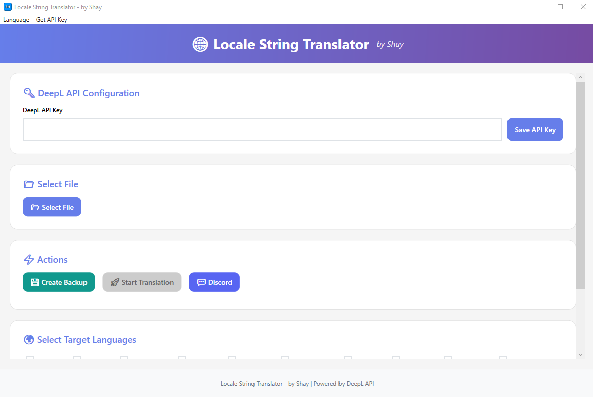

# Locale String Translator - by Shay



## ⚠️ IMPORTANT NOTICE

**This tool was developed exclusively for the Multilanguage System of Mali and is designed only for its `locale_string.txt` files from the client!**

**It does NOT work with all `locale_string.txt` files!** The tool is specifically adapted to the format and structure of Mali client files.

## Overview

The **Locale String Translator** is a professional tool for automatic translation of locale string files. The tool uses the DeepL API to create precise and reliable translations.

## Features

### 🔑 DeepL API Integration
- Easy input and storage of DeepL API key
- Automatic validation of API key
- Display of remaining translation limits

### 📁 File Processing
- Supports `locale_string.txt` files
- Automatic recognition and processing of tab-separated format
- Preservation of original file structure and formatting

### 🌍 Multilingual Translation
- Translation into over 25 languages:
  - German, English, French, Spanish, Italian
  - Portuguese, Russian, Japanese, Chinese, Korean
  - Polish, Dutch, Turkish, Swedish, Danish
  - Norwegian, Finnish, Czech, Hungarian, Romanian
  - Bulgarian, Greek, Slovak, Slovenian, Estonian
  - Latvian, Lithuanian

### 🛡️ Format Preservation
- **Placeholder Protection**: Automatic preservation of `%d`, `%s`, `%u`, etc.
- **Tag Protection**: `[ENTER]` remains untranslated
- **Bracket Translation**: Other tags like `[Gilde]`, `[SungMa-Invasionsportal]` are translated
- **Empty Lines**: Empty lines are correctly preserved
- **Tabs**: Tab formatting is maintained

### 💾 Backup Function
- Automatic creation of backups before translation
- Timestamped backup files in the `backups` folder

### 📊 Progress Display
- Real-time progress bar
- Display of translated, remaining, and erroneous entries

### 🌐 Localization
- User interface in German and English
- All messages are displayed in the selected language

### 🔔 Notifications
- Windows notification upon completion of translation
- Detailed information about successful and failed translations

## Supported File Formats

The tool is specifically designed for **`locale_string.txt`** files that use the following format:

```
ID<TAB>Text
```

**Example:**
```
1926	[SungMa-Invasionsportal] A SungMa invasion portal has opened. [ENTER]Open your map.
1938	[Gilde] %d Yang were withdrawn.
```

## File Formatting

- **Separator**: Tabs (`\t`) between ID and text
- **Encoding**: ANSI (Windows-1252)
- **Placeholders**: `%d`, `%s`, `%u`, etc. are automatically protected
- **Tags**: 
  - `[ENTER]` remains untranslated
  - Other tags like `[Gilde]` are translated

## Output

The tool creates a separate file for each selected language:
- `locale_string_EN.txt` (English)
- `locale_string_FR.txt` (French)
- `locale_string_PT.txt` (Portuguese)
- etc.

All files are saved in the same directory as the original file.

## System Requirements

- Windows 10 or higher
- .NET Framework 4.8
- Valid DeepL API key

## DeepL API Key

A DeepL API key can be obtained on the official DeepL website:
https://www.deepl.com/de/pro-api

## Developed by

**Shay**

---

*Locale String Translator - by Shay | Powered by DeepL API*

